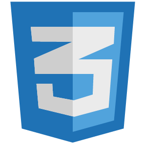

<h3>
  
  <span>CSS:</span>
</h3>

- Вопрос [Каковы различные подходы к стилизации в React, и какие преимущества и недостатки у каждого из них?]()
  Существует множество различных подходов к стилизации в React, каждый из которых имеет свои преимущества и подходит для определённых задач. Давайте рассмотрим основные из них:

  ### 1. **CSS/SASS/SCSS (Классический подход)**

  - **Описание:** Этот подход включает использование обычных файлов `.css`, `.sass`, или `.scss`. Стили можно подключать глобально или импортировать непосредственно в компоненты.
  - **Примеры:**
    - **CSS:** Файлы стилей подключаются через тег `<link>` или импортируются в компонент:
      ```jsx
      import './styles.css';
      ```
    - **SCSS/SASS:** Расширенные возможности стилизации с вложенностью и переменными.
  - **Преимущества:**
    - Простота и привычность.
    - Широкая поддержка в сообществе и документации.
    - Хорошо подходит для больших проектов с уже существующими CSS-файлами.
  - **Недостатки:**
    - Может возникнуть конфликт имен классов.
    - Стили глобальны, и их трудно изолировать в пределах компонентов.

  ### 2. **CSS Modules**

  - **Описание:** Этот подход предполагает использование модулей CSS, которые локализуют стили для каждого компонента. Файлы именуются как `Component.module.css`.
  - **Примеры:**

    ```jsx
    import styles from './Button.module.css';

    function Button() {
      return <button className={styles.button}>Click me</button>;
    }
    ```

  - **Преимущества:**
    - Автоматическая изоляция классов и отсутствие конфликтов имен.
    - Легко использовать с существующими инструментами CSS.
  - **Недостатки:**
    - Визуально стили выглядят как обычные CSS, что может быть недостатком для разработчиков, привыкших к современным подходам.

  ### 3. **Tailwind CSS**

  - **Описание:** Utility-first CSS-фреймворк, который предлагает использовать готовые классы для быстрой стилизации элементов.
  - **Примеры:**
    ```jsx
    function Button() {
      return (
        <button className="bg-blue-500 hover:bg-blue-700 text-white font-bold py-2 px-4 rounded">
          Click me
        </button>
      );
    }
    ```
  - **Преимущества:**
    - Очень гибкий и удобный для быстрой стилизации.
    - Минимизирует необходимость написания пользовательского CSS.
    - Хорошо документирован и поддерживается сообществом.
  - **Недостатки:**
    - Могут возникнуть сложности с поддержкой больших проектов.
    - Меньше контроль над стилями на уровне компонентов.

  ### 4. **Styled Components**

  - **Описание:** Этот подход использует библиотеку `styled-components`, которая позволяет писать стили на JavaScript. Стили привязываются к компонентам с помощью шаблонных строк.
  - **Примеры:**

    ```jsx
    import styled from 'styled-components';

    const Button = styled.button`
      background-color: blue;
      color: white;
      font-size: 16px;
      border: none;
      border-radius: 5px;
      padding: 10px 20px;

      &:hover {
        background-color: darkblue;
      }
    `;

    function App() {
      return <Button>Click me</Button>;
    }
    ```

  - **Преимущества:**
    - Полная изоляция стилей внутри компонентов.
    - Поддержка динамических стилей через пропсы.
    - Легко использовать для стилизации компонент на основе состояний.
  - **Недостатки:**
    - Может привести к увеличению размеров бандла.
    - Понижение производительности в больших проектах из-за динамической генерации стилей.

  ### 5. **Emotion**

  - **Описание:** Библиотека для CSS-in-JS, которая предоставляет гибкость и высокую производительность. Позволяет писать стили как с помощью styled-components, так и через объектный синтаксис.
  - **Примеры:**

    ```jsx
    /** @jsxImportSource @emotion/react */
    import { css } from '@emotion/react';

    const buttonStyle = css`
      background-color: blue;
      color: white;
      padding: 10px;
      border: none;
      border-radius: 5px;
      &:hover {
        background-color: darkblue;
      }
    `;

    function Button() {
      return <button css={buttonStyle}>Click me</button>;
    }
    ```

  - **Преимущества:**
    - Высокая производительность.
    - Легко интегрируется с существующими инструментами CSS.
    - Поддерживает серверный рендеринг.
  - **Недостатки:**
    - Сложнее изучить, чем классический CSS или CSS Modules.

  ### 6. **BEM (Block-Element-Modifier)**

  - **Описание:** Методология именования классов, основанная на разделении блоков, элементов и модификаторов. Обычно используется в сочетании с классическим CSS или SCSS.
  - **Примеры:**
    ```css
    .button {
      ...;
    } /* Block */
    .button__icon {
      ...;
    } /* Element */
    .button--primary {
      ...;
    } /* Modifier */
    ```
  - **Преимущества:**
    - Строгая структура и порядок именования классов.
    - Легко масштабируется в больших проектах.
  - **Недостатки:**
    - Требует дисциплины в именовании классов.
    - Большое количество классов может стать громоздким.

  ### 7. **Atomic CSS (например, Atomic CSS, Tachyons)**

  - **Описание:** Atomic CSS — это подход, при котором создаются очень маленькие, утилитарные CSS-классы, которые можно комбинировать в HTML.
  - **Примеры:**
    ```html
    <button class="p-2 bg-blue-500 text-white font-bold rounded">Click me</button>
    ```
  - **Преимущества:**
    - Минимизация CSS-кода.
    - Высокая производительность за счет повторного использования классов.
  - **Недостатки:**
    - Сложность поддержки в долгосрочной перспективе.
    - Менее декларативный подход, который может быть труден для чтения и поддержки.

  ### 8. **Inline Styles**

  - **Описание:** Стили передаются непосредственно через атрибут `style` в JSX-компоненте.
  - **Примеры:**
    ```jsx
    function Button() {
      return (
        <button
          style={{
            backgroundColor: 'blue',
            color: 'white',
            padding: '10px',
            border: 'none',
            borderRadius: '5px',
          }}
        >
          Click me
        </button>
      );
    }
    ```
  - **Преимущества:**
    - Очень простой способ стилизации.
    - Динамические стили легко задавать прямо в JavaScript.
  - **Недостатки:**
    - Нет поддержки псевдоклассов (`:hover`, `:focus`) и медиа-запросов.
    - Меньше производительность из-за генерации инлайн-стилей в DOM.

  ### Вывод

  Выбор подхода к стилизации зависит от ваших требований, команды и проекта. Tailwind CSS и CSS Modules хороши для небольших проектов с ограниченными требованиями к изоляции стилей. Styled Components и Emotion — отличные варианты для крупных проектов, требующих полной изоляции стилей и динамических стилей. Atomic CSS подходит для проектов с высокой производительностью, в то время как BEM обеспечивает строгую организацию стилей в масштабируемых приложениях.

- Вопрос [что такое в CSS селектор класс псевдокласс?]()

  - Ответ [Давайте разберем эти основные понятия в CSS простыми словами:

  1. **Селектор:**

  - Селектор - это что-то в CSS, что указывает, на какой элемент в HTML-документе мы хотим применить стили. Например, если мы хотим стилизовать все абзацы `<p>`, то селектором будет `p`.

    ```css
    p {
      color: blue;
    }
    ```

  2. **Класс:**

  - Класс - это особый вид селектора, который начинается с точки (`.`). Вы можете присвоить класс элементу HTML, чтобы применить к нему определенные стили. Классы позволяют стилизовать несколько элементов одновременно.

    ```css
    .highlight {
      background-color: yellow;
    }
    ```

    ```html
    <p class="highlight">Этот текст выделен желтым</p>
    ```

  3. **Псевдокласс:**

  - Псевдокласс - это также вид селектора, но он используется для выбора элемента в определенном состоянии или контексте. Например, `:hover` выберет элемент, когда на него наведен курсор.

    ```css
    a:hover {
      text-decoration: underline;
    }
    ```

    В этом примере мы говорим, что когда пользователь наводит курсор на ссылку (`a`), подчеркивание текста должно появиться.

  4. **Псевдоселектор**

     **Псевдоселекторы** - это часть CSS, которая позволяет выбирать и стилизовать части элемента или состояния элемента. Они обычно используются вместе с селекторами для указания конкретных частей элементов. Вот несколько примеров псевдоселекторов:

     1. **::before и ::after:**

     - Псевдоселекторы `::before` и `::after` используются для добавления виртуальных элементов до или после содержимого элемента.

     ```css
     p::before {
       content: 'Дополнительный текст: ';
       font-weight: bold;
     }
     ```

     2. **::first-line и ::first-letter:**

     - `::first-line` применяет стили к первой строке текста внутри выбранного элемента, а `::first-letter` - к первой букве текста.

     ```css
     p::first-line {
       font-weight: bold;
     }

     p::first-letter {
       font-size: 150%;
       color: red;
     }
     ```

     3. **::nth-child и ::nth-of-type:**

     - `::nth-child` и `::nth-of-type` позволяют выбирать элементы на основе их порядкового номера внутри родительского элемента.

     ```css
     li:nth-child(odd) {
       background-color: #f2f2f2;
     }

     p:nth-of-type(3) {
       color: blue;
     }
     ```

     4. **::placeholder:**

     - Псевдоселектор `::placeholder` применяет стили к тексту-плейсхолдеру внутри элемента `<input>` или `<textarea>`.

     ```css
     input::placeholder {
       color: #999;
     }
     ```

     5. **::selection:**

     - `::selection` позволяет стилизовать выделенный текст на странице.

     ```css
     ::selection {
       background-color: yellow;
       color: black;
     }
     ```

     Псевдоселекторы предоставляют различные способы выбора и стилизации различных частей элементов, что делает их более гибкими в использовании.

     Таким образом, селекторы помогают выбирать элементы, классы позволяют группировать и стилизовать их похожим образом, а псевдоклассы добавляют стили в зависимости от состояний или контекста элемента. Эти основные понятия помогают вам контролировать стили ваших веб-страниц.]()

- Вопрос [Что такое CSS? И для чего он используется?]()

- Вопрос [Что такое CSS- Вопросправило?]()

- Вопрос [Варианты добавление CSS стилей на страницу?]()

  - Ответ [

  1. **Внутренние стили (встроенные стили)**:
     Вы можете включить CSS стили непосредственно внутри тега `<style>` внутри элемента `<head>` вашей HTML-страницы. Эти стили будут применяться только к данной странице.
     Пример:

     ```html
     <head>
       <style>
         body {
           background-color: lightblue;
         }
         h1 {
           color: navy;
         }
       </style>
     </head>
     ```

  2. **Внешние стили (подключение внешних CSS файлов)**:
     Вы можете создать отдельные файлы со стилями (обычно с расширением .css) и затем подключить их к вашей HTML-странице с помощью элемента `<link>` внутри `<head>`. Этот способ позволяет использовать одни и те же стили на нескольких страницах.
     Пример:

     ```html
     <head>
       <link rel="stylesheet" type="text/css" href="styles.css" />
     </head>
     ```

  3. **Встроенные стили (атрибуты `style`)**:
     Вы можете добавить инлайн-стили непосредственно к элементам HTML, используя атрибут `style`. Эти стили будут применяться только к конкретному элементу.

     Пример:

     ```html
     <p style="color: green; font-size: 16px;">
       Этот текст зеленого цвета и имеет размер 16 пикселей
     </p>
     ```

  4. **Импортированные стили (at-rule `@import`)**:
     Внутри элемента `<style>` или внешнего CSS файла, вы можете использовать правило `@import`, чтобы импортировать другие CSS файлы. Это позволяет создавать более организованные и модульные стили.

     Пример внутри `<style>`:

     ```css
     @import url('other-styles.css');
     ```

  5. **CSS фреймворки и библиотеки**:
     Вы также можете использовать готовые CSS фреймворки и библиотеки, такие как Bootstrap, Foundation, Materialize CSS и другие. Эти инструменты предоставляют набор готовых стилей и компонентов, которые можно легко интегрировать в вашу веб-страницу.

  Выбор способа зависит от конкретных потребностей проекта. Для больших и сложных проектов часто используется комбинация этих методов для лучшей организации и поддержки кода стилей.]()

- Вопрос [Типы позиционирования в CSS?]()
  -Ответ [Static, Relative, Absolute, Fixed, Sticky

  **Relative:** Можно сдвигать его относительно его изначального положения(вправо, лево и тд)

  **Absolute:** Элементы пропадают из общего потока для остальных элементов его как будто бы не существует; Позиционируется относительно
  ближайшего спозиционированного родителя

Fixed: Элемент пропадает из общего потока и закреплен на экране. Прокручивается вместе со страницей

  **Sticky:** Черный блок лежит внутри Бежевого и Черный сам по себе. Для черного блока еще делаем top: 0. И он цепляется к верхней части экрана но он липнет только в рамках одного блока

  **Fixed:** Элемент пропадает из общего потока и закреплен на экране. Прокручивается вместе со страницей

  **3.1 В чем разница position: fixed и sticky?**
  fixed зафиксирует элемент относительно окна просмотра, в то время как sticky «прилипает» к определенной точке на странице при прокрутке и поведение будет зависеть от того превысил ли он эту точку ]()

- Вопрос [Блочная модель CSS?]()

- Вопрос [Что такое селектор? И какие селекторы существуют?]()

  - Ответ [В контексте веб-разработки термин "селектор" обычно используется в CSS и в библиотеках, таких как jQuery, чтобы выбирать HTML-элементы для применения стилей или выполнения манипуляций DOM.

  ### В CSS:

  В CSS селекторы используются для выбора элементов на веб-странице. Некоторые базовые селекторы в CSS:

  1. **Элементный селектор:**

     ```css
     p {
       /* стили для всех элементов <p> */
     }
     ```

  2. **Идентификатор (ID) селектор:**

     ```css
     #myElement {
       /* стили для элемента с id="myElement" */
     }
     ```

  3. **Классовый селектор:**

     ```css
     .myClass {
       /* стили для всех элементов с классом "myClass" */
     }
     ```

  4. **Групповой селектор:**

     ```css
     h1,
     h2,
     h3 {
       /* стили для всех элементов <h1>, <h2>, <h3> */
     }
     ```

  5. **Дочерний селектор:**

     ```css
     div > p {
       /* стили для всех элементов <p>, являющихся прямыми потомками элементов <div> */
     }
     ```

  6. **Псевдоклассы:**

     ```css
     a:hover {
       /* стили для ссылки при наведении курсора */
     }
     ```

  ### В jQuery:

  В jQuery селекторы также используются для выбора элементов DOM. Некоторые примеры селекторов в jQuery:

  1. **Элементный селектор:**

     ```javascript
     $('p'); // выбрать все элементы <p>
     ```

  2. **Идентификатор (ID) селектор:**

     ```javascript
     $('#myElement'); // выбрать элемент с id="myElement"
     ```

  3. **Классовый селектор:**

     ```javascript
     $('.myClass'); // выбрать все элементы с классом "myClass"
     ```

  4. **Комбинированный селектор:**

     ```javascript
     $('div p'); // выбрать все элементы <p>, являющиеся потомками элементов <div>
     ```

  Селекторы предоставляют мощные инструменты для выбора и манипуляции элементами веб-страницы и являются важной частью стилей и скриптов в веб-разработке.]()

- Вопрос [Что такое специфичность селектора? Как считать вес селектора?]()

- Вопрос [ Какие псевдоэлементы вы знаете]()

  - Ответ [В CSS псевдоэлементы представляют собой виртуальные элементы, которые можно выбирать и стилизовать, но они не существуют в HTML-документе. Вот несколько распространенных псевдоэлементов:

  1. **::before:**

  - Создает виртуальный элемент, который добавляется перед содержимым выбранного элемента.

  ```css
  p::before {
    content: 'Дополнительный текст: ';
    font-weight: bold;
  }
  ```

  2. **::after:**

  - Создает виртуальный элемент, который добавляется после содержимого выбранного элемента.

  ```css
  p::after {
    content: ' - конец';
    font-style: italic;
  }
  ```

  3. **::first-line:**

  - Применяет стили к первой строке текста внутри выбранного элемента.

  ```css
  p::first-line {
    font-weight: bold;
  }
  ```

  4. **::first-letter:**

  - Применяет стили к первой букве текста внутри выбранного элемента.

  ```css
  p::first-letter {
    font-size: 150%;
    color: red;
  }
  ```

  5. **::selection:**

  - Применяет стили к выделенному тексту.

  ```css
  ::selection {
    background-color: yellow;
    color: black;
  }
  ```

  6. **::placeholder:**

  - Применяет стили к тексту-плейсхолдеру внутри элемента `<input>` или `<textarea>`.

  ```css
  input::placeholder {
    color: #999;
  }
  ```

  7. **::before и ::after в комбинации с content:**

  - Используются для добавления декоративных элементов или контента внутрь элемента.

  ```css
  .quote::before {
    content: '«';
  }

  .quote::after {
    content: '»';
  }
  ```

  Это лишь несколько примеров псевдоэлементов, доступных в CSS. Каждый из них предоставляет дополнительные возможности для стилизации и улучшения внешнего вида элементов на веб-странице.]()

- Вопрос [Разница между Reset.css и Normalize.css?]()

- Вопрос [Разница между `margin` и `padding`?]()

- Вопрос [Разница между `display: none` и `visibility: hidden`?]()

        - Ответ [`display: none` и `visibility: hidden` — это два различных CSS-свойства, используемых для скрытия элементов, но они делают это по-разному.

      1. **`display: none`:**
        - **Действие:** Это свойство полностью убирает элемент из потока документа. Это означает, что элемент не будет занимать место в структуре документа, и макет будет пересчитан без учета этого элемента.
        - **Доступность:** Элемент, имеющий `display: none`, не будет доступен для пользователей, и скринридеры также не будут читать его содержимое.
        - **Пример:**
          ```css
          .hidden {
            display: none;
          }
          ```

      2. **`visibility: hidden`:**
        - **Действие:** Это свойство делает элемент невидимым, но он все равно остается в потоке документа, сохраняя свое место в структуре. Другими словами, элемент будет занимать место на странице, хотя его содержимое будет невидимым.
        - **Доступность:** Элемент с `visibility: hidden` будет скрыт от визуального восприятия, но его содержимое все равно будет доступно для скринридеров.
        - **Пример:**
          ```css
          .hidden {
            visibility: hidden;
          }
          ```

      Выбор между `display: none` и `visibility: hidden` зависит от ваших конкретных требований. Если вам нужно полностью скрыть элемент и освободить место в потоке документа, используйте `display: none`. Если вам нужно скрыть элемент, но сохранить его место в документе, используйте `visibility: hidden`.]()

- Вопрос [Разница между блочным и строчным (инлайновым) элементами?]()

- Вопрос [Разница между классом и идентификатором в CSS?]()

  - Ответ [В CSS классы и идентификаторы (ID) - это два разных типа селекторов, предоставляющих различные способы выбора и стилизации элементов на веб-странице. Вот основные различия между классами и идентификаторами в CSS:

  ### Классы:

  1. **Синтаксис:**

     - Используется точка (`.`) перед именем класса.

     ```css
     .myClass {
       /* стили для элементов с классом "myClass" */
     }
     ```

  2. **Множественное применение:**

     - Одному элементу можно присвоить несколько классов.

     ```html
     <div class="class1 class2">Этот элемент имеет два класса</div>
     ```

  3. **Множественное использование:**

     - Один и тот же класс может использоваться на нескольких элементах.

     ```html
     <p class="highlight">Этот параграф выделен</p>
     <p class="highlight">И этот тоже</p>
     ```

  ### Идентификаторы:

  1. **Синтаксис:**

     - Используется решетка (`#`) перед именем идентификатора.

     ```css
     #myId {
       /* стили для элемента с id="myId" */
     }
     ```

  2. **Уникальность:**

     - Идентификатор должен быть уникальным на странице; каждый элемент может иметь только один идентификатор.

     ```html
     <div id="uniqueElement">Этот элемент уникален</div>
     ```

  3. **Однократное использование:**

     - Один и тот же идентификатор не может быть использован на нескольких элементах.

     ```html
     <!-- Неверно: два элемента с одинаковым id -->
     <p id="sameId">Этот элемент</p>
     <p id="sameId">и этот элемент имеют одинаковый id</p>
     ```

  ### Когда использовать:

  - Используйте классы, когда стили должны применяться к нескольким элементам схожего вида или функционала.
  - Используйте идентификаторы, когда стили или скрипты должны применяться к конкретному, уникальному элементу.

  Пример использования класса:

  ```css
  .button {
    background-color: #3498db;
    color: #fff;
    padding: 10px 20px;
    border: none;
    border-radius: 5px;
  }
  ```

  Пример использования идентификатора:

  ```css
  #header {
    font-size: 24px;
    font-weight: bold;
    color: #333;
  }
  ```

  Оба подхода имеют свои места в веб-разработке, и выбор между классами и идентификаторами зависит от конкретных требований проекта.]()

- Вопрос [Что такое CSS спрайт? И для чего он используется?]()

- Вопрос [Что такое вендорные префиксы? И для чего они используются?]()

- Вопрос [Адаптивная верстка их ей методы?]()

  - Ответ [
    1. Резиновая верстка ( указываем размеры в относительных единицах %, rem, em )
    2. Flex, grid layouts
    3. Медиазапросы под разные размеры ]()

  Адаптивная верстка - это подход в веб-разработке, который позволяет создавать веб-сайты таким образом, чтобы они корректно отображались на различных устройствах и экранах, включая десктопы, планшеты и мобильные устройства. Адаптивная верстка обеспечивает удобство использования сайта независимо от размера экрана, что особенно важно в эпоху мобильных технологий. Вот несколько методов для реализации адаптивной верстки:

  1. **Media Queries:**

  - Media Queries позволяют применять стили CSS в зависимости от характеристик устройства, таких как ширина экрана, высота экрана и т.д. Например:

    ```css
    @media screen and (max-width: 768px) {
      /* Стили, применяемые на экранах шириной до 768 пикселей */
    }
    ```

  2. **Гибкая сетка (Flexible Grids):**

  - Использование относительных единиц измерения, таких как проценты, для создания гибкой сетки, которая может изменяться в зависимости от размера экрана.

    ```css
    .container {
      width: 80%; /* Пример гибкой сетки с шириной 80% экрана */
      margin: 0 auto; /* Центрирование контейнера */
    }
    ```

  3. **Гибкие изображения (Flexible Images):**

  - Использование свойства `max-width: 100%;` для изображений, чтобы они могли масштабироваться в зависимости от размера контейнера.

    ```css
    img {
      max-width: 100%;
      height: auto;
    }
    ```

  4. **Mobile-First Design:**

  - Проектирование сначала для мобильных устройств, а затем добавление стилей для более крупных экранов с использованием Media Queries.

  5. **Flexbox и Grid:**

  - Использование CSS-моделей размещения, таких как Flexbox и Grid, для создания гибких и адаптивных макетов.

  6. **Viewport Meta Tag:**

  - Использование мета-тега viewport для контроля отображения страницы на мобильных устройствах.

    ```html
    <meta name="viewport" content="width=device-width, initial-scale=1.0" />
    ```

  7. **Mobile Frameworks:**

  - Использование мобильных фреймворков, таких как Bootstrap или Foundation, которые предоставляют готовые компоненты и сетки для адаптивной верстки.

  Адаптивная верстка - это комбинация этих методов, и часто разработчики выбирают сочетание, наилучшим образом соответствующее требованиям конкретного проекта.

- Вопрос [Что такое псевдоэлементы? И для чего они используются?]()

- Вопрос [Что такое схлопывание границ (margin collapsing)?]()

- Вопрос [Что такое CSS препроцессор?]()

- Вопрос [Что такое `z- Вопросindex`? Как формируется контекст наложения?]()

- Вопрос [Порядок наложения элементов в CSS (Stacking Order)?]()

- Вопрос [Как с помощью CSS определить, поддерживается ли свойство в браузере?]()

- Вопрос [Как поддерживать страницы в браузерах с ограниченными функциями?]()

- Вопрос [Как исправлять специфичные проблемы со стилями для разных браузеров?]()

- Вопрос [Глобальные ключевые слова в CSS?]()

- Вопрос [Что такое CSS- Вопросатрибут (`attr`)?]()

- Вопрос [Что такое перечисление селекторов?]()

- Вопрос [Для чего используется ключевое слово `currentColor` в CSS?]()

- Вопрос [Какие псевдоклассы были добавлены в CSS3?]()

- Вопрос [Какие фильтры есть в CSS?]()

- Вопрос [Для чего используется псевдокласс `:invalid`?]()

- Вопрос [Расскажите про свойство `display` в CSS?]()

- Вопрос [В каком случае лучше использовать `translate()` вместо абсолютного позиционирования?]()

- Вопрос [Что такое плавающие элементы (floats)? Как они работают?]()

- Вопрос [Расскажите о свойстве `text- Вопросrendering`?]()

- Вопрос [Расскажите о свойстве `text- Вопросdecoration- Вопросskip- Вопросink`?]()

- Вопрос [Расскажите о свойстве `pointer- Вопросevents`?]()

- Вопрос [Расскажите о свойстве `outline`?]()

- Вопрос [Расскажите о свойстве `scrollbar- Вопросgutter`?]()

- Вопрос [Почему не стоит использовать краткую запись свойств CSS?]()

- Вопрос [Назовите псевдоэлементы для подсветки текста?]()

- Вопрос [Способы задания цвета в CSS?]()

- Вопрос [Какие CSS- Вопроссвойства используются для создания анимаций и плавных переходов?]()

- Вопрос [Принципы и подходы для обеспечения масштабируемости и поддерживаемости CSS- Вопроскода?]()

- Вопрос [Плюсы и минусы методологии БЭМ?]()

- Вопрос [Какие CSS- Вопроспрепроцессоры вы знаете? Преимущества их использования?]()

- Вопрос [Какое CSS- Вопроссвойство используется для изменения порядка отображения элементов на веб- Вопросстранице без изменения их физического расположения в HTML- Вопроскоде?]()

- Вопрос [Разница между псевдоклассами и псевдоэлементами?]()

- Вопрос [Как создавать и поддерживать единый стиль CSS на больших проектах?]()

- Вопрос [Что такое "контейнерные запросы" (container queries)? Как они отличаются от медиазапросов (media queries)?]()

- Вопрос [Расскажите о псевдоклассе `:has()`?]()

- Вопрос [Расскажите о медиафункции `prefers- Вопросreduced- Вопросmotion`?]()
